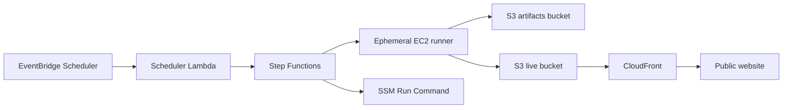

# redlink-database

`redlink-database` builds a public static website for exploring Wikipedia redlinks from Wikimedia SQL dumps.

The project converts a small set of dump tables to Parquet, reads them through DuckDB, builds a temporary `redlink` relation, and publishes a static site with grouped redlinks, wanted pages, wanted categories, and browser-side search.

> [!NOTE]
> The website reflects a dump snapshot, not live Wikipedia state.

## ✨ At a glance

- **Input:** Wikimedia SQL dumps
- **Core engine:** Python + DuckDB + Parquet
- **Output:** static HTML, CSS, JS, and compact JSON assets
- **Hosting model:** S3 + CloudFront
- **Search model:** browser-side trigram search over static shards
- **Wiki scope:** any Wikimedia language edition supported by the required dump tables
- **Current public site default:** `enwiki`

## 🔎 Overview

Wikipedia [redlinks](https://en.wikipedia.org/wiki/Wikipedia:Red_link) are links to pages that do not exist yet.

The main goals of this project are:
- publish a public site for browsing redlinks at scale
- keep the serving model static, cheap, and simple to operate
- use the pipeline as a practical data-engineering project

## ⚙️ What it does

For one wiki language, the pipeline:

1. discovers the latest dump version
2. downloads the required `.sql.gz` files
3. decompresses them
4. converts the selected dump data to Parquet
5. opens the Parquet parts in DuckDB
6. builds a temporary `redlink` table
7. exports compact web assets and renders static HTML pages from Jinja templates

The active dump tables are:

- `page`
- `pagelinks`
- `categorylinks`
- `linktarget`

The project currently considers only article and category redlinks.

### Website

The generated site stays fully static and includes a homepage, a browse-by-initial view backed by grouped JSON, a search page, wanted pages, wanted categories, plus `robots.txt` and `sitemap.xml`.

### Search

The current search is fully static and browser-side.

It:

- normalizes query text and titles
- requires a minimum query length of `3`
- generates fixed trigrams
- uses trigram-based planning
- paginates results in the browser

This is intentionally a cost-driven tradeoff:

- hosting stays simple and inexpensive
- very common substrings are slower than a real backend search service

## 🛠️ Tech stack

### Application

- Python `3.14`
- DuckDB
- Parquet via `pyarrow`
- Jinja2

### Infrastructure

- Terraform
- Packer
- AWS Lambda
- AWS Step Functions
- AWS EventBridge Scheduler
- Amazon EC2
- AWS Systems Manager Run Command
- Amazon S3
- Amazon CloudFront
- Amazon SNS
- Amazon CloudWatch Logs
- AWS Budgets
- Cloudflare DNS

## 📦 Setup

From the repository root:

```bash
uv sync
```

Then run the CLI either as a module:

```bash
python3.14 -m redlink_database --help
```

or through the installed console script:

```bash
redlink-database --help
```

## 💻 Local usage

Run the full pipeline:

```bash
python3.14 -m redlink_database --language en
```

Run only selected phases:

```bash
python3.14 -m redlink_database --language en --download --decompress
python3.14 -m redlink_database --language en --import
python3.14 -m redlink_database --language en --web
```

Force a rerun for an already downloaded local dump:

```bash
python3.14 -m redlink_database --language en --web --force
```

Run the pipeline on a different language wiki:

```bash
python3.14 -m redlink_database --language it
```

Standard local checks:

```bash
uvx ruff format --check
uvx ruff check
```

## ☁️ AWS architecture

The cloud setup is intentionally simple and cost-aware.



Main characteristics:

- single AWS account
- single region: `us-east-1`
- ephemeral EC2 runner for heavy work
- pre-baked AMI built with Packer
- static site served from S3 through CloudFront
- Cloudflare used for DNS and custom domain
- SSM-only operational access

Public hostname: `redlink.riccardoruspoli.com`

## 🏗️ Terraform and deployment

Infrastructure is split into:

- `infra/bootstrap/` for remote-state backend resources
- `infra/main/` for runtime infrastructure

At a high level:

- application or AMI provisioning changes require rebuilding the runner AMI
- infrastructure changes require applying Terraform
- the `bootstrap` and `main` Terraform stacks stay separate because the runtime stack depends on an already-created remote backend

## 🧪 CI

GitHub Actions currently provides validation, not deployment.

The workflow in `.github/workflows/validate.yml` validates Ruff, Terraform, and Packer on relevant source and infrastructure changes.

Infrastructure deployment remains manual on purpose.

## ⚖️ License and data provenance

The repository source code is released under the MIT License. See `LICENSE`.

The generated website and exported datasets use data derived from Wikimedia dump files. Underlying Wikimedia content remains subject to the applicable Wikimedia licenses and terms, generally `CC BY-SA 4.0` for text, plus Wikimedia Terms of Use and project-specific exceptions.

This project is not affiliated with or endorsed by the Wikimedia Foundation.
